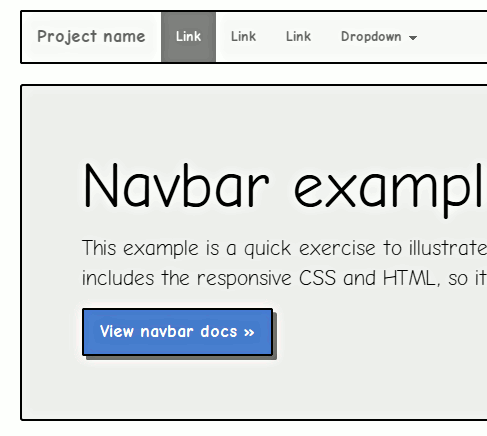

bootstrap_MockupTheme
=====================

a bootstrap theme that will make your site look more like a prototype.

Possibly useful if you want to show some ideas which you directly prototyped in code. Using a theme which shows that the design is preliminary may get you around »I don’t like this color« and »can we change this font to…«-discussions, so you can focus on more general things like determining if the site needs a prominent login or a sidebar etc.

You can [download the theme here](https://github.com/jdittrich/bootstrap_MockupTheme/releases) (choose the `bootstrap_MockupTheme\[number\].zip)

setup for development
-----
1.) clone this repo

2.) download Bootstrap from http://getbootstrap.com

3.) in the bootstrap_MockupTheme file `mockupTheme-bootstrap.less` set the path to the `/less/bootstrap.less` (first line) 
and `/less/utilities.less` (last line) files of bootstrap. (the current paths work out of the box, if you place the repo’s files 
in a new folder in bootstraps root folder (the one with `README.md` and the `LICENSE` in) 

4.) open a terminal, navigate to the folder you put this repo (bootstrap_MockupTheme) in and run `lessc mockupTheme-bootstrap.less bootstrap.css`

The resulting `css` file is created from the standard bootstrap files and has the MockupTheme customizations baked in. 

This process is modeled after the one [described by Thomas Park in smashing magazine](http://www.smashingmagazine.com/2013/03/12/customizing-bootstrap/)

example
-------

license – MIT/Expat
---------

Copyright (c) 2014 Jan Dittrich

Permission is hereby granted, free of charge, to any person obtaining a copy of this software and associated documentation files (the "Software"), to deal in the Software without restriction, including without limitation the rights to use, copy, modify, merge, publish, distribute, sublicense, and/or sell copies of the Software, and to permit persons to whom the Software is furnished to do so, subject to the following conditions:

The above copyright notice and this permission notice shall be included in all copies or substantial portions of the Software.

THE SOFTWARE IS PROVIDED "AS IS", WITHOUT WARRANTY OF ANY KIND, EXPRESS OR IMPLIED, INCLUDING BUT NOT LIMITED TO THE WARRANTIES OF MERCHANTABILITY, FITNESS FOR A PARTICULAR PURPOSE AND NONINFRINGEMENT. IN NO EVENT SHALL THE AUTHORS OR COPYRIGHT HOLDERS BE LIABLE FOR ANY CLAIM, DAMAGES OR OTHER LIABILITY, WHETHER IN AN ACTION OF CONTRACT, TORT OR OTHERWISE, ARISING FROM, OUT OF OR IN CONNECTION WITH THE SOFTWARE OR THE USE OR OTHER DEALINGS IN THE SOFTWARE.

